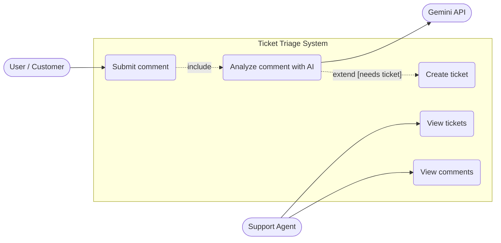

# Use case (Mermaid)

```mermaid
flowchart LR
  U([User / Customer])
  S([Support Agent])
  AI([Gemini API])
  subgraph SYS[Ticket Triage System]
    UC1(Submit comment)
    UC2(View comments)
    UC3(Analyze comment with AI)
    UC4(Create ticket)
    UC5(View tickets)
  end
  U --> UC1
  S --> UC2
  S --> UC5
  UC1 -. include .-> UC3
  UC3 -. "extend [needs ticket]" .-> UC4
  UC3 --> AI
```
