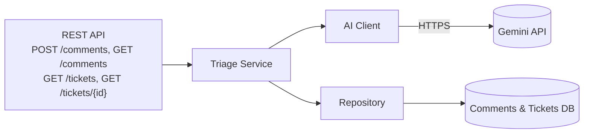

# Components (Mermaid)

```mermaid
flowchart LR
  API["REST API<br/>POST /comments, GET /comments<br/>GET /tickets, GET /tickets/{id}"] --> TS[Triage Service]
  TS --> AIC[AI Client]
  AIC -->|HTTPS| GEM[(Gemini API)]
  TS --> REPO[Repository]
  REPO --> DB[(Comments & Tickets DB)]
```
