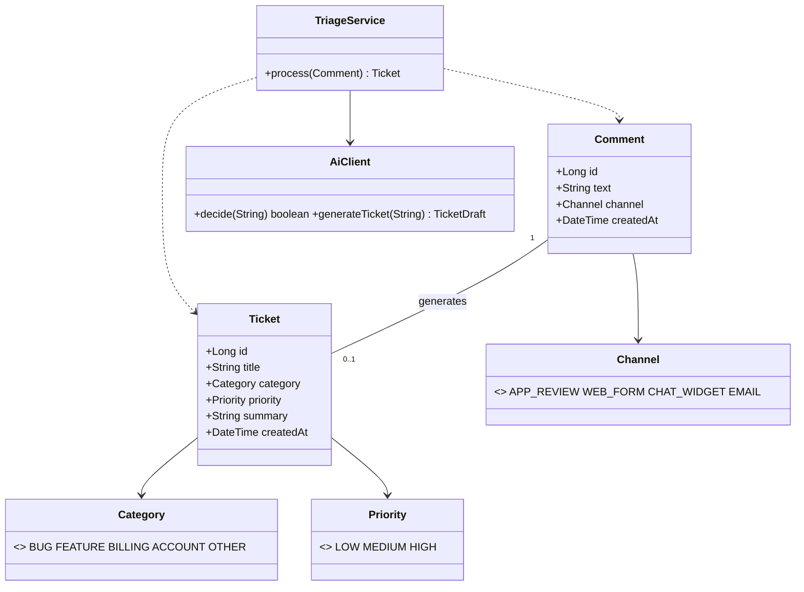

# Classes (Mermaid)

```mermaid
classDiagram
  class Comment {
    +Long id
    +String text
    +Channel channel
    +DateTime createdAt
  }
  class Ticket {
    +Long id
    +String title
    +Category category
    +Priority priority
    +String summary
    +DateTime createdAt
  }
  class Channel { <<enumeration>> APP_REVIEW WEB_FORM CHAT_WIDGET EMAIL }
  class Category { <<enumeration>> BUG FEATURE BILLING ACCOUNT OTHER }
  class Priority { <<enumeration>> LOW MEDIUM HIGH }
  class TriageService { +process(Comment) Ticket }
  class AiClient { +decide(String) boolean +generateTicket(String) TicketDraft }

  Comment "1" -- "0..1" Ticket : generates
  Comment --> Channel
  Ticket --> Category
  Ticket --> Priority
  TriageService --> AiClient
  TriageService ..> Comment
  TriageService ..> Ticket
```
