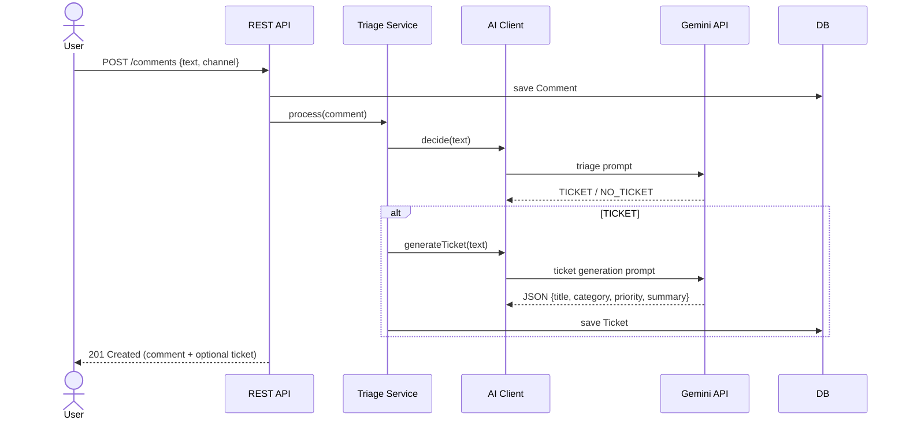

# Sequence: comment submission with AI triage (Mermaid)

```mermaid
sequenceDiagram
  actor User
  participant API as REST API
  participant TS as Triage Service
  participant AI as AI Client
  participant G as Gemini API
  participant DB

  User->>API: POST /comments {text, channel}
  API->>DB: save Comment
  API->>TS: process(comment)
  TS->>AI: decide(text)
  AI->>G: triage prompt
  G-->>AI: TICKET / NO_TICKET
  alt TICKET
    TS->>AI: generateTicket(text)
    AI->>G: ticket generation prompt
    G-->>AI: JSON {title, category, priority, summary}
    TS->>DB: save Ticket
  end
  API-->>User: 201 Created (comment + optional ticket)
```
