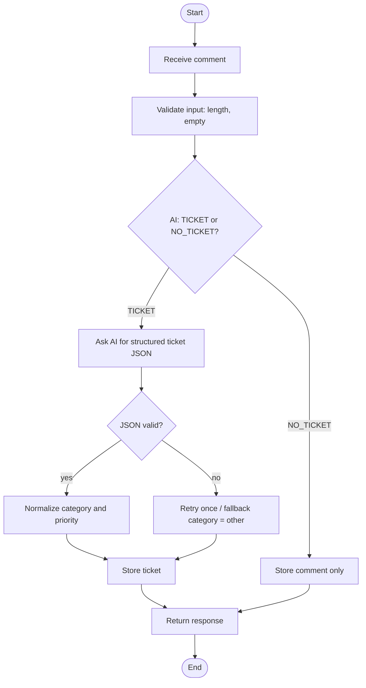

# Activity: triage decision flow (Mermaid)

```mermaid
flowchart TD
  A([Start]) --> B[Receive comment]
  B --> C[Validate input: length, empty]
  C --> D{"AI: TICKET or NO_TICKET?"}
  D -- TICKET --> E[Ask AI for structured ticket JSON]
  E --> F{JSON valid?}
  F -- yes --> G[Normalize category and priority]
  G --> H[Store ticket]
  F -- no --> I["Retry once / fallback category = other"]
  I --> H
  D -- NO_TICKET --> J[Store comment only]
  H --> K[Return response]
  J --> K
  K --> L([End])
```
